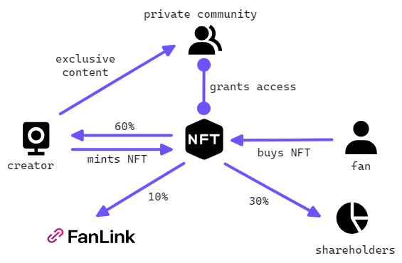

## Description
FanLink is a dApp that aims to empower YouTube creators and their communities through exclusive memberships.
The platform is based on the Stacks blockchain.
## How does it work?
A content creator is able to create tradable shares of his channel through this contract.
Once a share gets acquired, the shareholder perceives revenue from the creator's NFT mints.

Content creators can mint NFTs of their YouTube videos. Once minted, NFTs are sold to fans. Holding this NFT grants access to a private community provided with exclusive content and groupchats.
At first sale, creators get 60% of the transaction value, the platform takes 10%, and 30% is distributed to shareholders.

## Smart Contracts
### shareholders.clar
- Create channel shares
- Buy shares
- Pay shareholders

### video-nfts.clar
- Mint NFTs
- Update NFT price
- Transfer NFT

### video-nfts.clar
- Mint NFTs
- Update NFT price
- Transfer NFT

